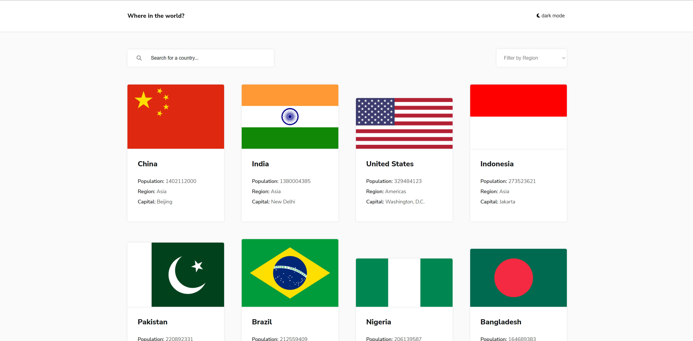

# Frontend Mentor - REST Countries API with color theme switcher solution

This is a solution to the [REST Countries API with color theme switcher challenge on Frontend Mentor](https://www.frontendmentor.io/challenges/rest-countries-api-with-color-theme-switcher-5cacc469fec04111f7b848ca). Frontend Mentor challenges help you improve your coding skills by building realistic projects.

## Table of contents

- [Overview](#overview)
  - [The challenge](#the-challenge)
  - [Screenshot](#screenshot)
  - [Links](#links)
- [My process](#my-process)
  - [Built with](#built-with)
  - [What I learned](#what-i-learned)
  - [Continued development](#continued-development)
  - [Useful resources](#useful-resources)
- [Author](#author)
- [Acknowledgments](#acknowledgments)

## Overview
Premier projet "recap" avec la manipulation de data, fetch d'un api. Projet fait en 12h

### The challenge

Users should be able to:

- See all countries from the API on the homepage
- Search for a country using an `input` field
- Filter countries by region
- Click on a country to see more detailed information on a separate page
- Click through to the border countries on the detail page
- Toggle the color scheme between light and dark mode *(optional)*

### Screenshot



### Links

- Solution URL: [Add solution URL here](https://your-solution-url.com)
- Live Site URL: [Add live site URL here](https://your-live-site-url.com)

### Built with

- Semantic HTML5 markup
- CSS custom properties
- CSS Grid
- Sass
- Mobile-first workflow
- [React](https://reactjs.org/) - JS library

### What I learned

J'ai pas vraiment appris de nouveau, ce projet étais avait pour but de pratiquer ce que j'ai appris en regardant des "crash courses".
Par contre il y a quelques petit éléments clé don't je suis fier:

- l'implantation du dark theme où j'utilise 4 variables de couleurs que j'update selon le theme sélectionné. Aucun component utilise les variable de couleur dans le :root ce qui rend le theming de la placeforme très dynamique.
```css
.app--light {
    --background: var(--light-gray);
    --component: var(--white);
    --text: var(--dark-blue-text);
    --input: var(--dark-gray);
}
.app--dark {
    --background: var(--dark-blue-bg);
    --component: var(--dark-blue-el);
    --text: var(--white);
    --input: var(--white);
}
```

- formatter le data au complet plutôt que de modifier les components après avoir vue la structure de l'api.
Exemple: lorsque je liste les langues je m'attendait à recevoir un array pour que je puisse mapper les strings, mais l'api me renvoi un objet. J'ai fait une fonction réutilisable qui transforme un objet en array.

```
```js
// transform an object into an array of the given property (or the actual value)
function getArray(object, prop = null) {
  let array = []
  for (const key in object) {
    if (Object.hasOwnProperty.call(object, key)) {
      // get prop of the object || get the value
      const value = prop ? object[key][prop] : object[key];
      array = [...array, value]
    }
  }
  return array
}
...
{
  ...
  currencies: getArray(fetchedData[key].currencies, 'name'),
  languages: getArray(fetchedData[key].languages),
  ...
}
```

### Continued development

Dans les prochains futur, je vais continuer à regarder des concepts et outils plus avancé comme redux / axios / formik, etc. et

## Author

- Website - [William Lafortune-Caissy](https://williamlafortunecaissy.github.io/)

